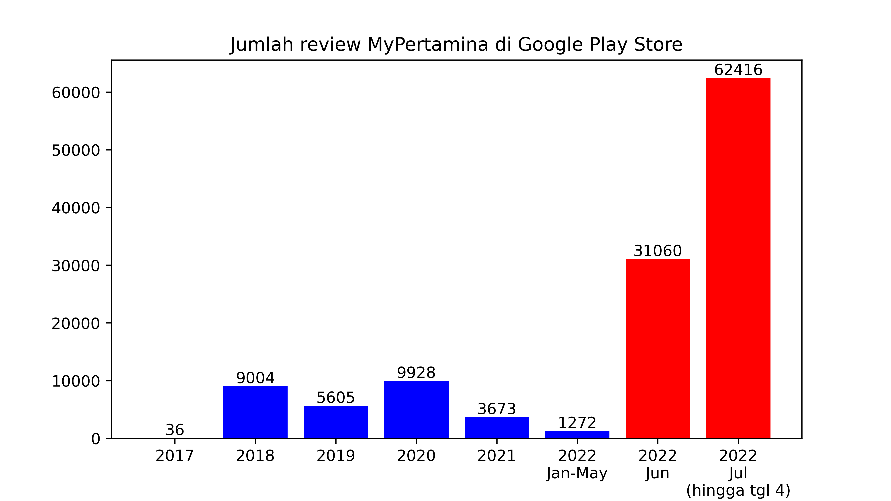

Respon Publik kepada MyPertamina setelah Diwajibkan: Sebuah Pendekatan Data Science
=======

Belakangan ini, katanya, aplikasi MyPertamina wajib digunakan jika hendak membeli BBM di SPBU. Sepertinya akan jadi *side project* yang seru melihat bagaimana respon masyarakat terhadap berita yang menghebohkan ini. Saya mengumpulkan data ulasan pengguna aplikasi MyPertamina di Google Play Store lalu mencoba ulik-ulik, siapa tahu dapat informasi menarik. Saya mengumpulkan data dengan cara *web scraping*.

Aplikasi MyPertamina sebenarnya sudah ada sejak agak lama. Google Play Store mencatat tanggal rilis pertama adalah 8 Agustus 2017. Saya sendiri sudah sering lihat di SPBU ada poster yang intinya mengajak install aplikasi, nanti akan dapat rewards. Saya dari dulu tidak pernah coba install karena HP saya gampang penuh -- dan karena saya kurang percaya aplikasinya bakalan bagus. Takut cuma *gimmick* dan kurang berguna.

Ketika saya melakukan *scraping*, aplikasi terakhir diupdate tanggal 28 Juni 2022. Pas sekali, karena, katanya, wajib daftar di aplikasi MyPertamina terhitung per 1 Juli. Masyarakat tentu saja tidak suka dipersulit. Bensin adalah bahan kebutuhan pokok, untuk apa dipersulit? Rating aplikasi MyPertamina di Google Play Store pun jadi salah satu tempat masyarakat meluapkan amukan.

*Rating*-nya jeblok banget. Untung itu bukan grafik saham. Boncos.

Gara-gara heboh isu tersebut pula, jumlah ulasan pengguna MyPertamina di Google Play Store meningkat tajam. Bulan Juni dan Juli 2022 saja jumlahnya mengalahkan tahun-tahun sebelumnya. 

Tampaknya aplikasi MyPertamina jadi viral dalam waktu sekejap dan jadi perbincangan dan perseteruan.

Selain tiba-tiba ramai, sentimen dari kolom ulasan benar-benar berubah drastis merespon heboh isu wajib aplikasi ini.

Grafik di atas itu *range*-nya dari -1 sampai 1. Kalau polaritas sentimen secara rata-rata ada di angka 0, berarti sentimen positif dan negatif imbang. Tapi terlihat jelas bahwa tiba-tiba sentimen dari review turun jauh berkisar pada tanggal 1 Juli.

Dalam pendekatan sains data untuk teks -- disebut juga *text mining*, dapat ditampilkan unigram, bigram, trigram, dll. yang paling sering muncul di dalam sekumpulan teks. Iseng-iseng, saya ingin tahu kata-kata apa saja, sih, yang dituliskan para pengguna MyPertamina ketika memberikan ulasan negatif.

Yah, ternyata, memang. Paling banyak mengeluh aplikasinya "ribet" dan "menyusahkan". Yang menarik, sepertinya banyak juga yang mengeluhkan memakai HP di pom bensin.

Lah, iya juga ya. Katanya, tidak boleh merokok, menggunakan kamera, dan menggunakan HP di SPBU. Kok, ini, malah disuruh wajib pakai aplikasi? (Sebenarnya, katanya, cukup bawa print-out QR code... tapi jadinya balik lagi: ribet.)

---

Singkat cerita, begitulah yang bisa dilihat dari kolom ulasan MyPertamina di Google Play Store. Saya iseng melakukan koding untuk *scraping* dan analisis pada tanggal 4 Juli lalu, sehingga boleh jadi kondisinya sudah berubah sekarang.

Jika tertarik, bolehlah mampir ke laman repositori Github saya untuk lihat kodingan beserta file hasilnya di [repository saya][repository link].

P.S.: Jika Anda *recruiter*, boleh juga menghubungi saya buat *ngasih* pekerjaan. Hehehe.

[Repository link]: https://github.com/lahdjirayhan/respon-publik-mypertamina